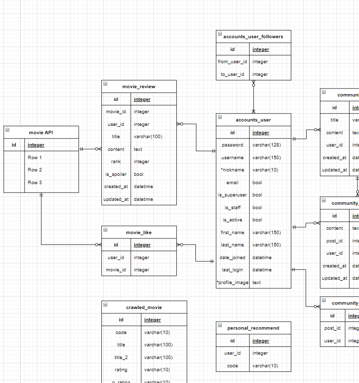

# PJT-Final

## 팀원 

- 김지슬 (팀장)
  - 프론트엔드
  - 크롤링
- 장영남
  - 백엔드
  - 크롤링
  - 추천 알고리즘 

## 목표

- 영화 정보 기반 추천 서비스 구성

- 커뮤니티 서비스 구성

- HTML, CSS, JavaScript, Vue.js, Django, REST API, DataBase 등을 활용한 실제 서비스 설계

- 서비스 관리 및 유지보수

## 개요

- 아무리 잘 구성된 사이트라고 하더라도, 이용자들이 없다면 무용지물이라고 생각합니다.
- 따라서 저희 팀은 **"사람들이 어떻게 하면 저희 사이트를 많이 이용할 수 있을지"**를 중점에 두었습니다.
  - 사용자의 입장에서 필요한 기능은 넣고, 불필요한 기능은 굳이 넣지 않는다. 

## 페이지 구성

- nav
  - home으로 가는 로고
  - 상세 추천
  - 자유 게시판
  - 유저
    - 로그인했을 때 (프로필사진) - 프로필, 설정(회원정보 수정), 로그아웃
    - 로그인하지 않았을 때 - 로그인, 회원가입
- HOME
  - carousels
    - 사이트 소개 영상, 이벤트
  - 영화 추천 주제와 그에 따른 영화 몇개만
- 영화 상세 페이지
  - 메인
    - 제목, 내용, 포스터, 장르, 시청 등급, 평점, 개봉날짜, 상영시간, 트레일러 
  - 좋아요
  - 리뷰
    - 평점(별), 내용, 아이디, 날짜, 수정/삭제, 스포박스 
- 유저정보 관련 
  - 프로필
    - 팔로우, 팔로워 
      - 목록으로 나타내기 
    - 유저가 쓴 글, 리뷰 
      - 목록으로 나타내기 
    - 좋아요한 영화
      - 목록으로 나타내기 
  - 로그인 / 로그아웃 
  - 회원가입
    - 연동
      - 구글
    - 비연동
      - 아이디 / 비밀번호
      - 프로필 사진
      - 닉네임
      - 이메일
  - 회원정보 수정
    - 비밀번호 변경
    - 회원 탈퇴 (작게)
- footer
  - 우리 정보 

## 전체 진행상황

- ~~네이버 크롤링 - 100%~~ 
  - 데이터 4842개
- ~~tmdb 크롤링 - 100%~~
  - 데이터 6000개
- 유저
  - 로그인 / 로그아웃
    - F - 80%
      - 유효성 검사 나타내기
    - ~~B - 100 %~~
  - 회원가입
    - F - 80%
      - 유효성 검사 나타내기
    - ~~B - 100 %~~
  - 프로필
    - F - 0%
    - B - 30%
      - 한사람의 정보(팔로워, 팔로잉 전부 다)를 다 담은 url
      - 팔로우 url
  - 회원정보 수정
    - F - 0%
    - B - 0%
- 자유게시판
  - 상세 조회
    - F - 70%
      - 댓글 (하는중)
      - 좋아요
    - B - 80 %
      - 좋아요
  - 생성 / 수정
    - F - 80%
      - 유효성 검사
    - ~~B - 100 %~~
  - ~~삭제 - 100%~~

- 추천 
  - 0%
- 영화 디테일
  - 0% 

## 날짜별 진행 상황

- 11월 15일

  - 기획 및 페이지 구성 회의
  - 네이버 크롤링 코드 작성 

- 11월 16일 

  - 네이버 크롤링 완료 

  - tmdb 크롤링 코드 완성

    - 추천 알고리즘에 사용하기 위함 

  - vue 구조 1차

    

  - ERD 구조 1차 

    

11월 17일 수요일 
=======

- 11월 17일 
  - tmdb 크롤링 완료
  - 프로젝트 생성
  - 프론트엔드
    - 게시글 목록, 게시글 상세 조회, 게시글 작성
    - 회원가입, 로그인, 로그아웃
  - 백엔드 
    - 자유게시판 CRUD, 댓글 CRUD, 
    - 회원가입, 로그인, 로그아웃

- 11월 18일 목요일 
  - 프론트엔드 
    - 자유게시판 CRUD 서버에서 가져오고 넘기기
    - 댓글 CRUD
    - profile 틀 설계 
  - 백엔드 
    - serializer 수정 (게시글 - 댓글까지 한번에 넘기기)
    - 게시판 R / UD 요청 분리
    - 팔로잉 팔로워
    - 게시글 좋아요
    - 프로필
      - 요청시 팔로잉, 팔로워, 좋아요, 활동내용까지 다 넘겨주기

---

- 11월 19일 금
  - 프론트엔드
    - profile 끝내기 (작업 중)
    - 영화 디테일 / 추천 구조 끝내기 
  - 백엔드
    - movie app 만들기, 영화 디테일, 리뷰, 좋아요 등 (작업 중)
    - api 사용하여 주제에 맞는 영화 데이터 넘겨주기 

- 11월 20일 토
  - 프론트엔드
    - 부족한 구조 끝내기 
    - css 시작 
  - 백엔드
    - 놀기

- 11월 21일 일
  - 프론트엔드
    - css
  - 백엔드
    - 추천 알고리즘 구현 

- 11월 22일 월
  - 프론트엔드
    - 추가 기능 
  - 백엔드
    - 추가 기능 

- 11월 23일 화
  - 1차 완성 
    - 프론트엔드
      - 추가 기능 
    - 백엔드
      - UCC 만들기 

- 11월 24일 수
  - UCC 제출 
  - README 정리
  - 프로젝트 최종 완성 

- 11월 25일 목
  - PPT 제출
  - 

